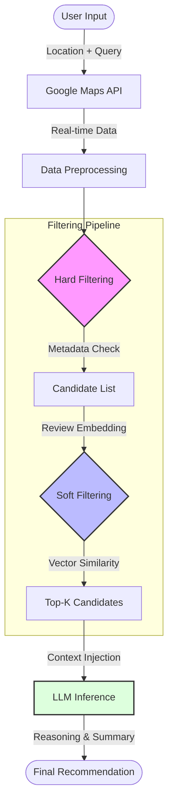
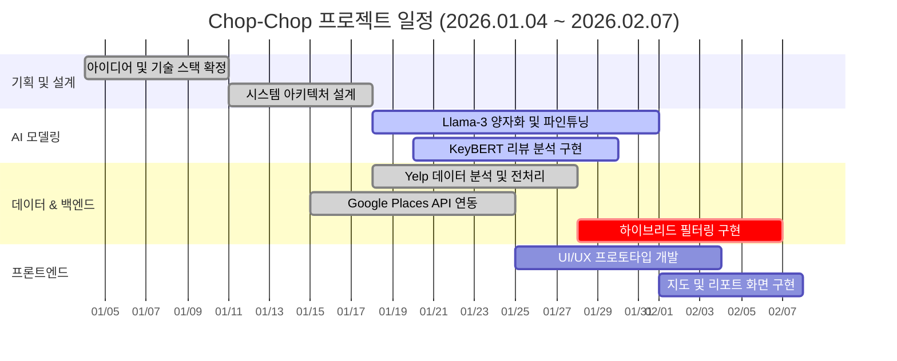

# Chop-Chop (찹찹)

> **AI-Powered Smart Dining Recommendation Service**
>
> "맛집을 찹찹(빠르게) 찾아주고, 재료를 찹찹 썰듯 데이터를 분석합니다."

<br>

## 1. 프로젝트 개요

### 1.1 서비스 소개
**"지도 앱의 별점만으로는 알 수 없는 '진짜' 맛집을 찾아줍니다."**

Chop-Chop은 사용자의 **현재 위치**와 **구체적인 상황(Context)**을 기반으로, 가장 적합한 식당을 실시간으로 분석하고 추천해주는 AI 서비스입니다.
기존의 정적인 데이터베이스 조회 방식에서 벗어나, **Google Maps API**의 실시간 데이터와 **LLM(Llama-3, Gemini)**의 추론 능력을 결합한 **RAG(Retrieval-Augmented Generation)** 파이프라인을 통해 "지금, 여기"에 딱 맞는 맛집을 제안합니다.

### 1.2 프로젝트 목표 (Technical Goals)
* **실시간 RAG 파이프라인 구축**: 미리 데이터를 적재(Accumulate)하지 않고, 사용자 요청 시점에 Google Maps API를 호출하여 폐업/휴무 이슈가 없는 **100% 실시간 데이터**를 제공합니다.
* **비용 효율적인 하이브리드 필터링**: API 호출 비용과 LLM 토큰 비용을 절감하기 위해 **Metadata Filtering(Hard)**과 **Vector Similarity(Soft)**를 결합한 다단계 필터링 아키텍처를 설계합니다.
* **LLM 최적화 및 경량화**: Llama-3 8B 모델을 **Quantization(양자화)** 및 Fine-tuning하여, 로컬 환경에서도 빠르고 정확하게 리뷰 맥락을 파악합니다.
* **사용자 의도 기반 추론**: 단순 키워드 매칭(Keyword Match)을 넘어, "소개팅 하기 좋은", "부모님 모시고 가기 좋은"과 같은 **추상적 의도(Intent)**를 이해하는 추천 시스템을 구현합니다.

### 1.3 팀 구성 (Team Members)

<table>
  <tr>
    <td align="center"></td>
    <td align="center"></td>
    <td align="center"></td>
  </tr>
  <tr>
    <td align="center"><b>전준성 (Leader)</b></td>
    <td align="center"><b>이승훈 (AI Engineer)</b></td>
    <td align="center"><b>유혜린 (Data Scientist)</b></td>
  </tr>
  <tr>
    <td align="center">Full Stack & Architecture</td>
    <td align="center">LLM Optimization & RAG</td>
    <td align="center">Data Analysis & QA</td>
  </tr>
  <tr>
    <td align="left">
      • <b>RAG 파이프라인 아키텍처</b> 설계<br>
      • React/FastAPI <b>풀스택 개발</b><br>
      • Google Places API 비용 최적화<br>
      • Git Flow 및 일정 총괄 관리
    </td>
    <td align="left">
      • Llama-3 <b>모델 경량화(Quantization)</b><br>
      • <b>KeyBERT</b> 리뷰 키워드 추출 구현<br>
      • 하이브리드 필터링 알고리즘 개발<br>
      • 임베딩 벡터 검색 최적화
    </td>
    <td align="left">
      • <b>Yelp 데이터셋 분석</b> 및 속성 정의<br>
      • 추천 시스템 <b>RMSE 지표</b> 관리<br>
      • 프롬프트 엔지니어링 전략 수립<br>
      • 데이터 전처리 파이프라인 구축
    </td>
  </tr>
  <tr>
    <td align="center">
      <a href="https://github.com/your-github-id">
        
      </a>
    </td>
    <td align="center">
      <a href="https://github.com/your-github-id">
        
      </a>
    </td>
    <td align="center">
      <a href="https://github.com/your-github-id">
        
      </a>
    </td>
  </tr>
</table>

<br>

<br>

## 2. 핵심 기능 (Key Features)

* **위치 기반 실시간 분석 (Real-time Location Analysis)**
    * 사용자의 현재 좌표(Lat/Lng)를 기준으로 반경 내 식당을 실시간 탐색합니다.
    * 영업 여부(Open Now), 브레이크 타임 등 최신 정보를 즉시 반영합니다.

* **하이브리드 필터링 (Hybrid Filtering)**
    * **Hard Filtering:** 주차 가능, 가격대, 카테고리 등 명확한 스펙은 메타데이터로 즉시 필터링.
    * **Soft Filtering:** 리뷰 임베딩(Embedding) 유사도 검색을 통해 분위기, 감성 등 정성적 요소를 매칭.

* **LLM 기반 추천 근거 (AI Reasoning)**
    * Quantized Llama-3 및 Gemini 모델이 리뷰 문맥을 분석합니다.
    * 단순 리스트 나열이 아닌, **"왜 이 식당이 당신의 상황에 맞는지"**에 대한 설득력 있는 리포트를 제공합니다.

* **리뷰 키워드 추출 (Review Summarization)**
    * **KeyBERT**를 활용해 수백 개의 리뷰에서 핵심 키워드(청결, 맛, 친절, 소음 등)를 추출하고 요약합니다.

<br>

## 3. 시스템 아키텍처 (System Architecture)

비용 효율적이고 반응 속도가 빠른 **검색 증강 생성(RAG)** 아키텍처를 채택했습니다.


## 4. 개발 일정 (WBS)

### 🗓️ 상세 업무 분담표 (Milestone)

| 기간 | 구분 | 담당자 | 상세 개발 내용 |
| :---: | :---: | :---: | :--- |
| **1주차**<br>(1/4~1/10) | **기획 &<br>기술 검증** | **전원** | - 아이디어 선정 및 시장 조사 (기존 지도 앱 분석)<br>- **Tech Spec 결정**: Google Maps API vs 네이버/카카오<br>- 아키텍처 설계: RAG 도입 여부 및 실시간성 검토 |
| **2주차**<br>(1/11~1/17) | **초기 세팅** | **전준성** | - Git Organization 생성 및 레포지토리 초기화<br>- Frontend(React) 및 Backend(FastAPI) 보일러플레이트 구축 |
| | | **이승훈** | - LLM 모델 선정(Llama-3 8B) 및 로컬 구동 테스트<br>- Quantization(양자화) 방법론 리서치 (AWQ vs QLoRA) |
| **3주차**<br>(1/18~1/24) | **Core<br>알고리즘** | **전준성** | - Google Places API 연동 (FieldMask 최적화)<br>- 위치 기반 반경 검색 로직 구현 |
| | | **이승훈** | - **KeyBERT** 기반 리뷰 키워드 추출 파이프라인 구현<br>- 임베딩 모델(SentenceTransformers) 테스트 |
| | | **유혜린** | - **Yelp 오픈 데이터셋 분석** 및 카테고리 매핑<br>- 식당 속성(Attribute) 체계 확립 (Hard/Soft Filter 기준) |
| **4주차**<br>(1/25~1/31) | **고도화 &<br>통합** | **전원** | - **하이브리드 필터링(Hybrid Filtering)** 로직 통합<br>- Backend API ↔ AI 모델 추론 파이프라인 연결 |
| | | **전준성** | - 로그인/회원가입(JWT) 및 개인화 DB 스키마 설계 |
| **5주차**<br>(2/1~2/7) | **UI/UX &<br>배포** | **전준성** | - 지도 UI 연동 및 추천 리포트 카드 디자인 구현<br>- 최종 디버깅 및 사용자 시나리오 테스트 |

### Gantt Chart

<br>

## 5. 기술 스택 (Tech Stack)

| Category | Technologies |
| :--- | :--- |
| **AI Model** | Llama-3 (8B), Gemini 1.5 Flash, KeyBERT, SentenceTransformers |
| **Optimization** | AWQ / QLoRA Quantization (4-bit 경량화), Fine-tuning |
| **Data Source** | Google Places API (New), Yelp Open Dataset |
| **Backend** | Python, FastAPI, REST API |
| **Frontend** | React.js, Node.js, Tailwind CSS |
| **Collaboration** | Git, Discord, Notion |

<br>

## 6. 기술적 고도화 및 트러블 슈팅

### 6.1 Google Places API 비용 및 레이턴시 최적화
- **문제 상황:** 식당 1개당 모든 데이터를 불러올 경우 API 비용이 과다하게 발생하고, 응답 속도가 느려지는 문제(Latency) 발생.
- **해결:** `FieldMask`를 적극적으로 도입하여 필요한 데이터(ID, DisplayName, Rating, Summary)만 선별적으로 호출.
- **성과:** API 호출 당 페이로드 크기 **70% 감소** 및 응답 속도 **0.5s 이내**로 단축.

### 6.2 LLM 입력 토큰 제한과 비용 문제 해결
- **문제 상황:** 수집된 리뷰 텍스트 전체를 LLM에 입력할 경우, Context Window 제한을 초과하거나 토큰 비용이 급증함.
- **해결:** **KeyBERT**를 활용해 리뷰의 핵심 키워드(최대 20개)만 추출하여 LLM에 주입하는 전처리 파이프라인 구축.
- **성과:** 토큰 사용량 **90% 절감** 및 추론 속도 개선.

### 6.3 정성적 데이터 필터링의 한계 극복 (Hybrid Filtering)
- **문제 상황:** "분위기 좋은"과 같은 추상적 쿼리는 단순 DB 필터링(Hard Filter)으로 검색이 불가능함.
- **해결:** Yelp 데이터셋으로 학습된 속성 기준을 적용하여, 리뷰 텍스트를 벡터화(Embedding)하고 사용자 쿼리와의 **Cosine Similarity**를 계산하는 Soft Filtering 도입.
- **성과:** 키워드가 정확히 일치하지 않아도 문맥상 유사한 식당을 추천하는 **Semantic Search** 구현.

<br>

## 7. 화면 설계 (UI Design)

| 메인 지도 화면 | 추천 결과 리포트 |
| :---: | :---: |
| *(스크린샷 예정)* | *(스크린샷 예정)* |
| **로그인 / 회원가입** | **필터 설정 화면** |
| *(스크린샷 예정)* | *(스크린샷 예정)* |

<br>

## 8. 프로젝트 구조

```bash
Chop-Chop/
├── backend/
│   ├── models/          # Quantized LLM & Embeddings
│   ├── api/             # API Endpoints (FastAPI)
│   ├── services/        # Recommendation Logic (Hybrid Filtering)
│   ├── utils/           # Google Maps API Handlers
│   ├── recommender.py   # Main RAG Pipeline
│   └── requirements.txt
├── frontend/
│   ├── public/
│   ├── src/
│   │   ├── components/  # Map, Card UI Components
│   │   └── pages/       # Login, Main, Result Pages
│   └── package.json
├── data/                # Pre-processed Datasets (Yelp/Google)
└── README.md
```
## 9. 회고 (Retrospective)

### **전준성 (Leader & Full Stack)**
> 
### **이승훈 (AI Model Engineer)**
> 
### **유혜린 (Data Scientist)**
>
